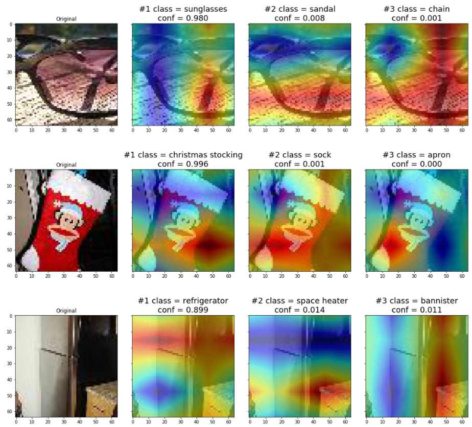

# Robust and Generalizable Computer Vision Classification
<b>Course:</b> CS182 (https://bcourses.berkeley.edu/courses/1487769/pages/cs-l-w-182-slash-282a-designing-visualizing-and-understanding-deep-neural-networks-spring-2020)

<b>Group Name:</b> YOLO9000

<b>Authors:</b> Ahad Rauf, Chris Sun, Michael Lavva, Kei Watanabe

<b>Link to the Paper:</b> [URL]

## Abstract:
We created a robust computer vision classifier that performs well in a dataset that contains perturbations. To achieve this, we used various data augmentation and other deep learning model techniques, such as model ensembling, image denoising, adversarial training, and attention networks. These methods helped improve the robustness against both naturally perturbed and adversarial datasets. In addition, we created class action map visualizations for our models to help understand how the model makes its classification decisions. Through these techniques, we achieved a 71.1% Top 1 Accuracy and 90.0% Top 5 Accuracy on the Tiny-ImageNet classification challenge.

## Setup / Dependencies:
This project requires PyTorch, OpenCV, NumPy, MatPlotLib, PIL, etc.

## Environment:
The project's environment was a Google Cloud’s Deep Learning VM instance and Nvidia Tesla K80 GPU / Nvidia T4.

## Dataset:
The dataset for this project is from https://tiny-imagenet.herokuapp.com/. To download it, go to the data folder in the master branch and run `get_data.sh`.

## Project Work:
There are several branches that include the work in the project:
* master: Contains denoising script.
* dev-ahad-adversarial: Generates adversarial examples.
* dev-ahad-finite-horizons
* dev-ahad-master
* dev-ahad-xai: Code for Explainable AI.
* dev-kei-resnet-vgg: Model & Snapshot Ensembling code
* resnet: Code for ResNet model.
* test-submission: Test submission code.
